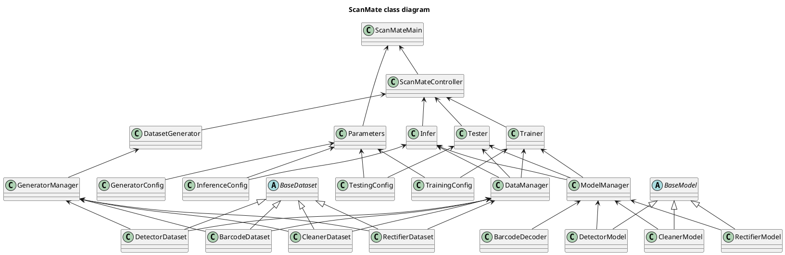

# ScanMate

## Description

ScanMate is a Python project for generating synthetic barcode/QR code datasets and detecting them in images.

## Class diagram

```plantuml
@startuml
title: ScanMate class diagram

class ScanMateMain{

}

class ScanMateController{

}

class Parameters{

}

class TrainingConfig{

}

class InferenceConfig{

}

class TestingConfig{

}

class GeneratorConfig{

}

class Trainer{

}

class Infer{

}

class Tester{

}

class DatasetGenerator{

}

class DataManager{

}

abstract class BaseDataset{

}

class BarcodeDataset{

}

class CleanerDataset{

}

class RectifierDataset{

}

class DetectorDataset{

}

abstract class BaseModel{

}

class ModelManager{

}

class BarcodeDecoder{

}

class CleanerModel{

}

class RectifierModel{

}

class DetectorModel{

}

class GeneratorManager{

}

ScanMateMain <-- Parameters
ScanMateMain <-- ScanMateController
ScanMateController <-- Trainer
ScanMateController <-- Infer
ScanMateController <-- Tester
ScanMateController <-- DatasetGenerator
Parameters <-- TrainingConfig
Parameters <-- InferenceConfig
Parameters <-- TestingConfig
Parameters <-- GeneratorConfig
Trainer <-- ModelManager
Trainer <-- DataManager
Trainer <-- TrainingConfig
Infer <-- ModelManager
Infer <-- DataManager
Infer <-- InferenceConfig
Tester <-- ModelManager
Tester <-- DataManager
Tester <-- TestingConfig
DataManager <-- BarcodeDataset
DataManager <-- CleanerDataset
DataManager <-- RectifierDataset
DataManager <-- DetectorDataset
ModelManager <-- BarcodeDecoder
ModelManager <-- CleanerModel
ModelManager <-- RectifierModel
ModelManager <-- DetectorModel
DatasetGenerator <-- GeneratorManager
BaseModel <|-- CleanerModel
BaseModel <|-- RectifierModel
BaseModel <|-- DetectorModel
BaseDataset <|-- BarcodeDataset
BaseDataset <|-- CleanerDataset
BaseDataset <|-- RectifierDataset
BaseDataset <|-- DetectorDataset
GeneratorManager <-- BarcodeDataset
GeneratorManager <-- CleanerDataset
GeneratorManager <-- RectifierDataset
GeneratorManager <-- DetectorDataset
@enduml
```